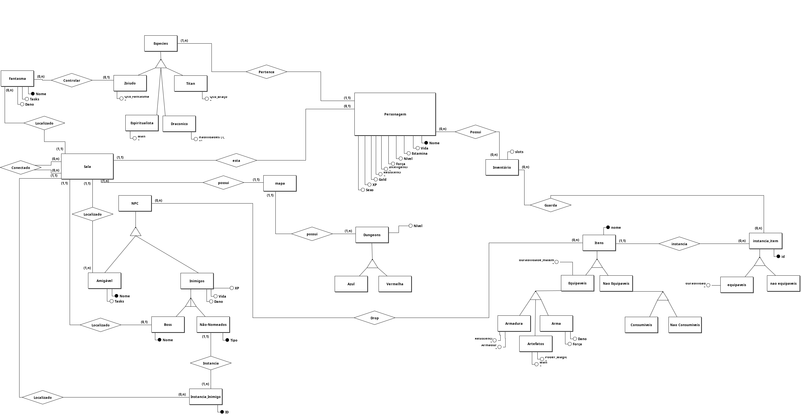
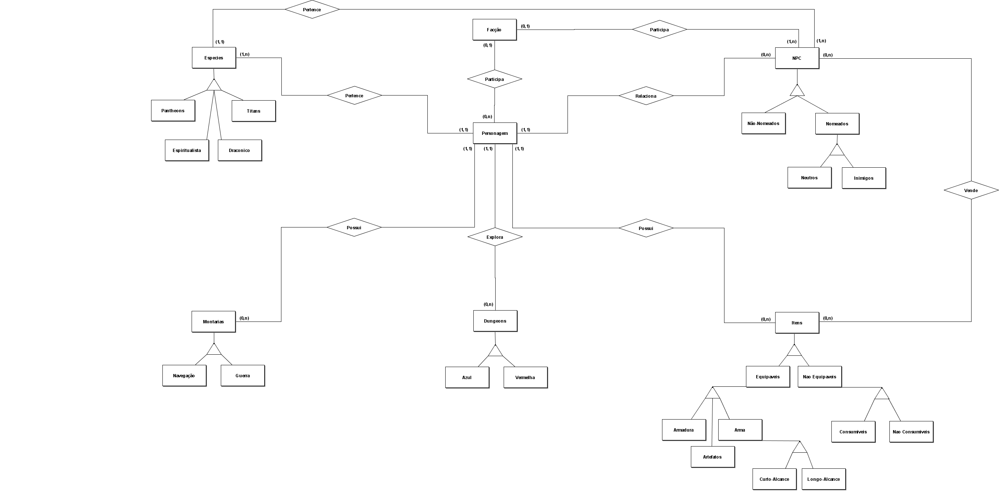
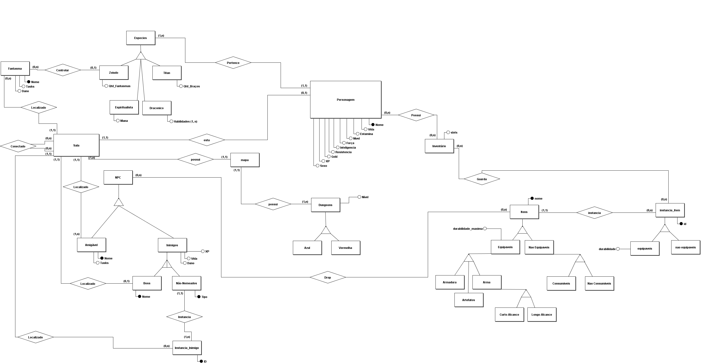

## Modelo Entidade-Relacionamento (MER)

### Introdução
O Modelo Entidade-Relacionamento (MER) é uma representação gráfica das entidades do sistema e dos relacionamentos entre elas. Ele serve como ponto de partida para o projeto de um banco de dados, permitindo visualizar de forma clara as regras de negócio e as conexões entre as tabelas que serão criadas posteriormente, está presente em alto nível, o visualizador precisando entender a semântica do modelo.

### Versão Final

Para maior liberdade de visualização, veja pela versão PDF.  
[Confira o PDF aqui](../../assets/merV3.pdf)

### Versões Anteriores

#### Versão 1

Para maior liberdade de visualização, veja pela versão PDF.  
[Confira o PDF aqui](../../assets/merV1.pdf)

#### Versão 2

Para maior liberdade de visualização, veja pela versão PDF.  
[Confira o PDF aqui](../../assets/merV2.pdf)

### Versão 3

Para maior liberdade de visualização, veja pela versão PDF.  
[Confira o PDF aqui](../../assets/merV3.pdf)
