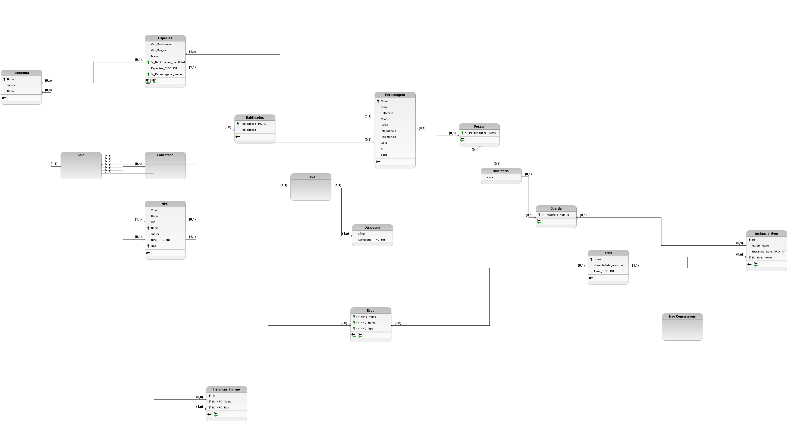

O Modelo Relacional traduz o MER em tabelas, atributos e chaves, definindo como os dados serão armazenados em um sistema de gerenciamento de banco de dados relacional (SGBDR). Cada entidade torna-se uma tabela, cada atributo torna-se uma coluna e os relacionamentos são implementados por meio de chaves estrangeiras.

#### Versão 1

Para maior liberdade de visualização, veja pela versão PDF.  
[Confira o PDF aqui](../../assets/relacionalV1.pdf)